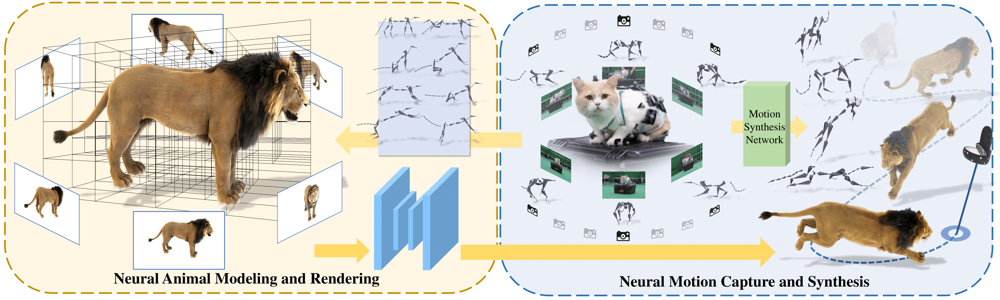

<!-- PROJECT LOGO -->
<br />
<p align="center">

  <h1 align="center">Artemis: Articulated Neural Pets with Appearance and Motion Synthesis </h1>

  <p align="center">
    
  </p>
  <p align="center">
    SIGGRAPH, 2022
    <br />
    <a href="https://HaiminLuo.github.io"><strong>Haimin Luo</strong></a>
    ·
    <a href=""><strong>Teng Xu</strong></a>
    ·
    <a href=""><strong>Yuheng Jiang</strong></a>
    ·
    <a href=""><strong>Chenglin Zhou</strong></a>
    ·
    <a href=""><strong>Qiwei Qiu</strong></a>
    ·
    <a href=""><strong>Yingliang Zhang</strong></a>
    ·
    <a href=""><strong>Wei Yang</strong></a>
    ·
    <a href="http://xu-lan.com/"><strong>Lan Xu</strong></a>
    ·
    <a href="http://www.yu-jingyi.com/cv/"><strong>Jingyi Yu</strong></a>
  </p>

  <p align="center">
    <!-- <a href="https://pytorch.org/get-started/locally/"></a><br><br> -->
    <a href='https://doi.org/10.1145/3528223.3530086'>
      
    </a>
    <a href='https://haiminluo.github.io/publication/artemis/' style='padding-left: 0.5rem;'>
      
    <a href='https://www.youtube.com/watch?v=Asbt3BYcZMM' style='padding-left: 0.5rem;'>
      
    </a>
  </p>
</p>

<br />

This repository contains a pytorch implementation and **D**ynamic **F**urry **A**nimal (DFA) dataset for the paper: [Artemis: Articulated Neural Pets with Appearance and Motion Synthesis](https://arxiv.org/abs/2202.05628). In this paper, we present **ARTEMIS**, a novel neural modeling and rendering pipeline for generating **ART**iculated neural pets with app**E**arance and **M**otion synthes**IS**.<br><br>

## Overview


## Installation
Create a virtual environment and install requirements as follow
```
conda create -n artemis python=3.7
conda activate artemis
pip install -r requirement.txt 
```
- Install pytorch3d following the official [installation steps](https://github.com/facebookresearch/pytorch3d/blob/main/INSTALL.md).
- Install cuda based pytorch extension for animatable volumes: [svox_t](https://github.com/HaiminLuo/svox_t). 


The code is tested on Ubuntu 18.04 + Pytorch 1.12.1.

## Dynamic Furry Animals (DFA) Dataset
The DFA dataset can be found at [DFA datasets](https://shanghaitecheducn-my.sharepoint.com/:f:/g/personal/luohm_shanghaitech_edu_cn/Et60lJpJdp5DoyQF7uzP6jgB_JEW4LIHixAyXEiVhHT3Vw?e=d09jtz), which contains multi-view renderings and skeletal motions of 9 high quality CGI furry animals. As described in Artemis, each dataset contains $1920\times1080$ RGBA images rendered under 36 cameras around the dynamic animal. 

The datasets (e.g., cat) are organized as follows:

```
cat
├──  img
│     └── run                     - Motion name.
│       └── %d                    - The frame number, start from 0. 					
│         └──img_%04d.jpg   		  - RGB images for each view. view number start from 0.
│         └──img_%04d_alpha.png   - Alpha mattes for corresponding RGB image.
│     └── ...
│
├──  volumes				
│     └── coords_init.pth			    - voxel coordinates represent an animal in rest pose.
│     └── volume_indices.pth      - The indices of bones to which the voxels are bound.
|     └── volume_weights.pth      - The skinning weights of the voxels.
|     └── radius.txt              - The radius of the volume. 
|
├──  bones
│     └── run                     - Motion name.
│       └── Bones_%04d.inf        - The skeletal pose for each frame, start from 0. In each row, the 3x4 [R T] matrix is displayed in columns, with the third column followed by columns 1, 2, and 4.
│     └── ...
|     └── bones_parents.npy       - The parent bone index of each bone.
|     └── Bones_0000.inf          - The rest pose.
| 
├──  CamPose.inf				          - Camera extrinsics. In each row, the 3x4 [R T] matrix is displayed in columns, with the third column followed by columns 1, 2, and 4, where R*X^{camera}+T=X^{world}.
│ 
└──  Intrinsic.inf				        - Camera intrinsics. The format of each intrinsics is: "idx \n fx 0 cx \n 0 fy cy \n 0 0 1 \n \n" (idx starts from 0)
│
└──  sequences				            - Motion sequences. The format of each motion is: "motion_name frames\n"
```

## Pre-trained model
Our pre-trained NGI models (e.g., `cat`, `wolf`, `panda`, ...) described in our paper can be found at [pre-trained models](https://shanghaitecheducn-my.sharepoint.com/:f:/g/personal/luohm_shanghaitech_edu_cn/EgJC3IrKA1pPjYTFiO2rVswBW4QVHkV54TqGxcxMIr-Bvw?e=H3xhTG).


## Rendering
We provide a rendering script to illustrate how to load motions, cameras, models and how to animate the NGI animals and render them.

To render a RGBA image with specified camera view and motion pose:
```
cd code

python render.py --config ../model/cat/configs.yml --model ../model/cat/model.pt --dataset ../dataset/cat --output_path ./output
```

To render an around-view video with dynamic motion and spiral camera trajectory:
```
cd code

python render.py --config ../model/cat/configs.yml --model ../model/cat/model.pt --dataset ../dataset/cat --output_path ./output --render_video --camera_path ../model/cat/
```


## Citation
If you find our code or paper helps, please consider citing:
```
@article{10.1145/3528223.3530086,
author = {Luo, Haimin and Xu, Teng and Jiang, Yuheng and Zhou, Chenglin and Qiu, Qiwei and Zhang, Yingliang and Yang, Wei and Xu, Lan and Yu, Jingyi},
title = {Artemis: Articulated Neural Pets with Appearance and Motion Synthesis},
year = {2022},
issue_date = {July 2022},
publisher = {Association for Computing Machinery},
address = {New York, NY, USA},
volume = {41},
number = {4},
issn = {0730-0301},
url = {https://doi.org/10.1145/3528223.3530086},
doi = {10.1145/3528223.3530086},
journal = {ACM Trans. Graph.},
month = {jul},
articleno = {164},
numpages = {19},
keywords = {novel view syntheis, neural rendering, dynamic scene modeling, neural volumetric animal, motion synthesis, neural representation}
}
```
And also consider citing another related and intresting work for high-quality photo-realistic rendering of real fuzzy objects: [Convolutional Neural Opacity Radiance Fields](https://www.computer.org/csdl/proceedings-article/iccp/2021/09466273/1uSSXDOinlu):
```
@INPROCEEDINGS {9466273,
author = {H. Luo and A. Chen and Q. Zhang and B. Pang and M. Wu and L. Xu and J. Yu},
booktitle = {2021 IEEE International Conference on Computational Photography (ICCP)},
title = {Convolutional Neural Opacity Radiance Fields},
year = {2021},
volume = {},
issn = {},
pages = {1-12},
keywords = {training;photography;telepresence;image color analysis;computational modeling;entertainment industry;image capture},
doi = {10.1109/ICCP51581.2021.9466273},
url = {https://doi.ieeecomputersociety.org/10.1109/ICCP51581.2021.9466273},
publisher = {IEEE Computer Society},
address = {Los Alamitos, CA, USA},
month = {may}
}
```